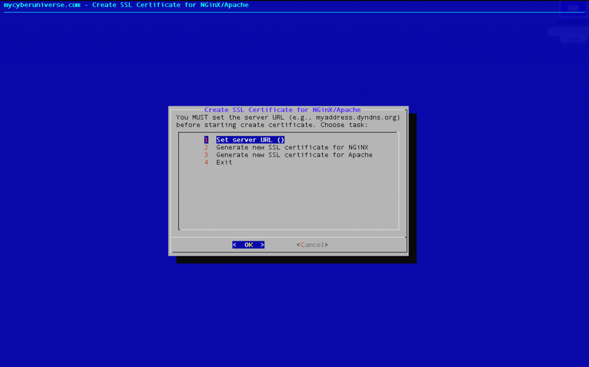

# SSL Certificate automatically by a BASH script

To quickly and easily create a self-signed SSL certificate for Apache and Nginx web servers I wrote a little script in BASH.



SSL certificates are required to ensure the secure transfer of information in the network. In cryptography and computer security, a self-signed certificate is an identity certificate that is signed by the same entity whose identity it certifies. That is, if you yourself, for your domain or IP address, created the SSL certificate it will be self-signed. Self-signed SSL certificates are ideal for internal use (intranet).


## Use

1. Before you run the script, you must set the script executable permission:
```
chmod +x ssl_crt_creater.sh
```

2. Run the script:
```
./ssl_crt_creater.sh
```

After you create the SSL certificate then you should bind it to the server.


## Description

To run the script required packages “dialog” and “openssl”. Package “dialog” is used to render the menu and package “openssl” is used to create certificate. If they are not installed then the script will prompt you to install them.

In the script, to create the certificate and key is used, this command for NginX:
```
openssl req -new -x509 -days 365 -nodes -out /etc/nginx/ssl/$__servername.crt -keyout /etc/nginx/ssl/$__servername.key
```

and this for Apache:
```
openssl req -new -x509 -days 365 -nodes -out /etc/apache2/ssl/$__servername.crt -keyout /etc/apache2/ssl/$__servername.key
```

Description of the arguments:

`req` – Request to create a new certificate.

`-new` – Creating a certificate request (Certificate Signing Request – CSR).

`-x509` – Instead of creating a CSR, create a self-signed certificate.

`-days 365` – Validity period is 365 days (1 year).

`-nodes` – Do not encrypt the private key.

`-out` – Where to store the certificate.

`-keyout` – Where to store the private key.

After running the script it will automatically create a new certificate and private RSA key length of 2048 bits. They will be placed in a working directory (Apache – ``/etc/apache2/ssl/``, NginX – ``/etc/nginx/ssl/``) and they will be set rights `600` for the security.

Now, your private key and certificate are available at:
```
/etc/apache2/ssl/*.crt и /etc/apache2/ssl/*.key
```

or at:
```
/etc/nginx/ssl/*.crt и /etc/nginx/ssl/*.key
```


## Contributing

Welcome and thanks! I appreciate you taking the initiative to contribute to this project.

Contributing isn’t limited to just code. I encourage you to contribute in the way that best fits your abilities, by writing tutorials, making translation to your native language, giving a demo at your local meetup, helping other users with their support questions, or revising  the documentation for this project.

Please take a moment to read the guidelines in the [CONTRIBUTING.md](CONTRIBUTING.md). Following them helps to communicate that you respect the time of the other contributors to the project. In turn, they’ll do their best to reciprocate that respect when working with you, across timezones and around the world.


## Security Vulnerabilities

If you discover a security vulnerability within this script, please send an email to me. All security vulnerabilities will be promptly addressed.


## License

This script is open-sourced software licensed under the [MIT](LICENSE.md) and is distributed free of charge.

Commercial licensing (e.g. for projects that can’t use an open-source license) is available upon request.


## Author

Arthur Garegnyan

* Email: arthurgareginyan@gmail.com

* GitHub: [https://github.com/ArthurGareginyan/](https://github.com/ArthurGareginyan/)

* Website: [http://www.arthurgareginyan.com](http://www.arthurgareginyan.com)

* Donation: [http://www.arthurgareginyan.com/donate.html](http://www.arthurgareginyan.com/donate.html)
